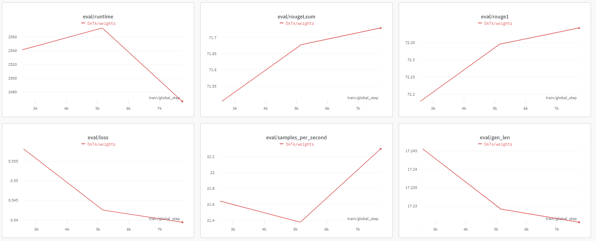

# README

Grammatical Error Correction (GEC) systems aim to correct grammatical mistakes in the text. Error correction can improve the quality of written text in emails, blog post, and chats.
The GEC task can be thought of as a sequence to sequence task where a Transformer model is trained to take an ungrammatical sentence as input and return a grammatically correct sentence.

My pet-project based on the post https://towardsdatascience.com/nlp-building-a-grammatical-error-correction-model-deep-learning-analytics-c914c3a8331b

I use prepared data from here https://drive.google.com/drive/folders/1kKlGcinD_FhGXC0LztN4Ts605YXzMEVA

In `gramma_corrector_T5.ipynb` I made a number of code modifications and got a finished model trained on 3 epochs.

This is also an example of any seq2seq task where we want to teach the network to correct errors or translate languages.

